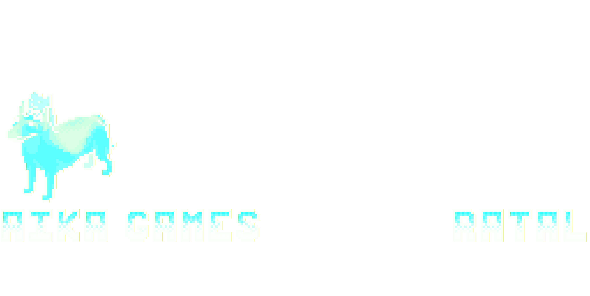
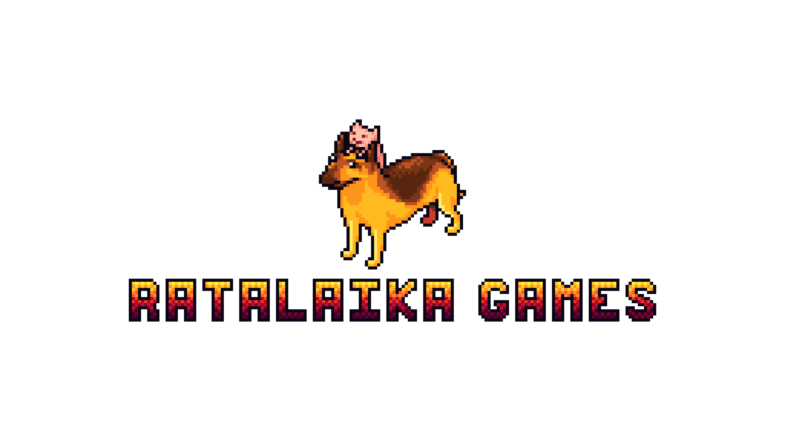
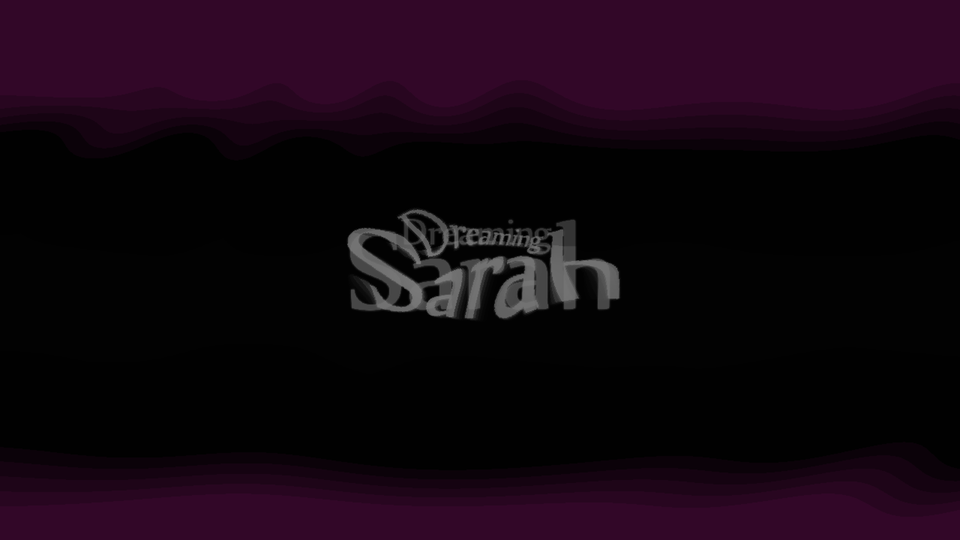
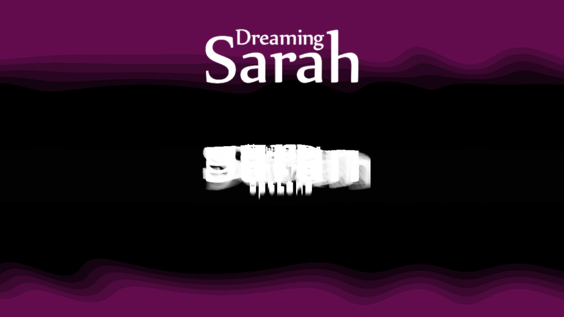

# ProsperT24

**Development fork of [Prosper](https://github.com/mattias800/prosper) — PS5 Emulator Runtime**

ProsperT24 is our development fork based on the original Prosper project by mattias800. This fork focuses on **CLI execution, diagnostics, runtime observation, and compatibility experimentation** for PS5 game emulation. We document our validation work, frame capture achievements, and rendering pipeline experiments here.

---

## ✅ Current Achievement

### `REAL_FRAME_CAPTURED`

| | |
|---|---|
| **Game** | PPSA02929 / Dreaming Sarah |
| **Engine** | Unity / IL2CPP |
| **Evidence ID** | `EXP-CLI-FRAME-REAL-001` |
| **Status** | ✅ REAL FRAME CAPTURED |

**PPSA02929 (Dreaming Sarah)** was successfully booted through our CLI (`boot_trace`) and produced a **real rendered first frame** captured via `--capture-first-frame`.

The initial first-frame capture has now been extended with a **real frame sequence** showing the boot/splash state followed by later rendered game-loading content. The CLI demonstrates continued observation of real rendered output beyond a single isolated frame.

This is not a synthetic test pattern — it is actual rendered game output from the PS5 present path.

---

## 📸 First Captured Frame



**Visual content:** Splash screen showing pixel-art teal dog character + "AIKA GAMES" logo + "RATTAL" branding text — consistent with Dreaming Sarah's actual boot screen.

---

## 🎬 Real Frame Sequence

The CLI has now been validated beyond a single first-frame capture. For PPSA02929 / Dreaming Sarah:

- **Frames 1–220** show the initial boot/splash state (RATALAIKA GAMES logo)
- **Frames 260–600** show later loading/game-rendered content (title screen, loading progression)

These are **captured runtime frames**, not synthetic test patterns.

Representative captured frames:



*Frame 200: Boot/splash screen with RATALAIKA GAMES logo*



*Frame 260: "Dreaming Sarah" title appearing*



*Frame 420: Title screen with loading indicator*

This demonstrates that the CLI can observe a **continuing sequence of real rendered output** from boot through game initialization.

---

## 🔧 CLI Capabilities

Our fork extends Prosper's `boot_trace` tool with **frame capture diagnostics**:

- Game boot via `boot_trace` (CLI/headless-style execution)
- Runtime/boot diagnostics output
- VideoOut/present observation (3840×2160 buffers)
- First-frame capture (`--capture-first-frame`)
- Continued frame sequence observation
- Real rendered-frame validation
- Frame metadata/integrity reporting
- **Observer-only capture** — does not modify game runtime behavior

---

## 📋 Example

```bash
export VK_ICD_FILENAMES=/usr/share/vulkan/icd.d/lvp_icd.json   # llvmpipe software Vulkan
export PROSPER_RENDER=1

./boot_trace <PPSA02929-app0> \
    --capture-first-frame PPSA02929_first_frame.bmp
# exit code: 0  (frame captured)
```

---

## ✅ Validation Summary

| Attribute | Value |
|-----------|-------|
| Source | **Real rendered output** (not synthetic) |
| Target resolution | 3840 × 2160 |
| Format | RGBA8 (32-bit) |
| Frame sequence | 1 → 220+ (extended) |
| Present count | 2+ |
| Capture mode | Observer-only (no runtime modification) |
| Vulkan renderer | llvmpipe (LLVM 19.1.7) |
| Observed range | Frames 1–600+ |

**All phases passed:** BUILD → BOOT → RUNTIME → REAL PRESENT → FRAME CAPTURE → SEQUENCE OBSERVATION

---

## 📎 Project Relationship

> ProsperT24 is a development fork based on **Prosper**. The original Prosper project is the upstream foundation; this fork documents and develops our CLI, diagnostics, rendering validation and compatibility work.

- **Upstream:** https://github.com/mattias800/prosper
- **Fork:** https://github.com/Sh-TB/prosperT24
- **No upstream modifications** — this fork is for development/testing only

---

## 🧪 Experiment

**Evidence ID:** `EXP-CLI-FRAME-REAL-001`

Full technical report, captured frames (PNG), runtime logs, metadata, and reproducibility notes are available in the release assets.

*Date: 2026-08-10*
