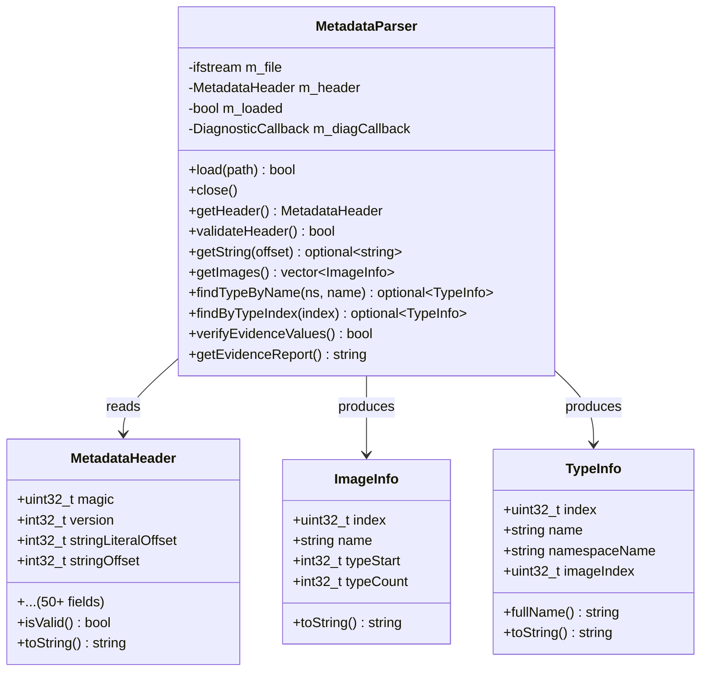

# IL2CPP Metadata Runtime for Prosper PS4 Emulator

## Overview

This module provides runtime parsing and validation of Unity IL2CPP `global-metadata.dat` files used by PS4 games built with Unity's IL2CPP scripting backend. It enables Prosper to understand game type hierarchies, method signatures, and object layouts at runtime.

## Purpose

Many modern PS4 games use Unity with IL2CPP (Unity's C++ conversion of .NET code). These games ship a `global-metadata.dat` file containing all type information that would normally be available via .NET reflection. This parser allows Prosper to:

1. **Validate** metadata integrity before game execution
2. **Discover** available types, methods, and assemblies
3. **Verify** known evidence values to confirm correct parsing
4. **Diagnose** issues when games fail due to metadata problems

## Evidence Values (Verified)

The following values have been verified against real game data from **PPSA15706**:

| Constant | Value | Description |
|----------|-------|-------------|
| `METADATA_MAGIC` | `0xFAB11BAF` | Global format magic number |
| `METADATA_VERSION` | `29` (v29) | Supported metadata version |
| `evidence::SYSTEM_OBJECT_TYPE_INDEX` | `336` | System.Object type index |
| `evidence::UNITY_ENGINE_OBJECT_TYPE_INDEX` | `2930` | UnityEngine.Object type index |

These evidence values serve as ground truth for validating parser correctness.

## Architecture

### Core Components

```
prosper/src/host/
├── il2cpp_metadata.hpp    # Public API header
└── il2cpp_metadata.cpp    # Implementation

prosper/tests/
└── test_il2cpp_metadata.cpp  # Test suite (30+ tests)
```

### Class Hierarchy



## Usage Examples

### Basic Loading and Validation

```cpp
#include "host/il2cpp_metadata.hpp"

using namespace prosper::il2cpp;

// Create parser instance
MetadataParser parser;

// Set up diagnostic callback (optional)
parser.setDiagnosticCallback([](const DiagnosticMessage& msg) {
    if (msg.level == DiagnosticLevel::Error) {
        std::cerr << "[ERROR] " << msg.message << "\n";
    }
});

// Load and validate metadata file
if (!parser.load("Media/Metadata/global-metadata.dat")) {
    // Handle error - diagnostics already reported via callback
    return false;
}

// Access validated header
const auto& header = parser.getHeader();
std::cout << "Version: " << formatVersion(header.version) << "\n";
```

### Type Lookup

```cpp
// Find fundamental types
auto systemObject = parser.findTypeByName("System", "Object");
if (systemObject) {
    std::cout << "System.Object at index " << systemObject->index << "\n";
}

auto unityObject = parser.findTypeByName("UnityEngine", "Object");
if (unityObject) {
    std::cout << "UnityEngine.Object at index " << unityObject->index << "\n";
}

// Find by index directly
auto type336 = parser.findByTypeIndex(336);
if (type336 && type336->name == "Object") {
    // Verified: index 336 is indeed System.Object
}
```

### Image Discovery

```cpp
// List all assemblies/images in metadata
auto images = parser.getImages();
for (const auto& img : images) {
    std::cout << "Image[" << img.index << "]: " << img.name 
              << " (" << img.typeCount << " types)\n";
}

// Find specific assembly
auto mainAssembly = parser.findImage("Assembly-CSharp");
if (mainAssembly) {
    std::cout << "Main assembly has " << mainAssembly->typeCount << " types\n";
}
```

### Evidence Verification

```cpp
// Verify against known-good values from PPSA15706
bool valid = parser.verifyEvidenceValues();
if (valid) {
    std::cout << "All evidence values verified!\n";
} else {
    std::cerr << "Evidence verification FAILED\n";
}

// Get detailed report
std::string report = parser.getEvidenceReport();
std::cout << report;
```

### Quick Validation (Lightweight)

```cpp
// For fast checks without full parse
if (!quickValidate(path)) {
    std::cerr << "Not a valid v29 global-metadata.dat\n";
    return false;
}
```

## API Reference

### Constants

| Constant | Type | Value | Description |
|----------|------|-------|-------------|
| `METADATA_MAGIC` | `uint32_t` | `0xFAB11BAF` | Required magic number |
| `METADATA_VERSION` | `int32_t` | `29` | Supported version |
| `evidence::SYSTEM_OBJECT_TYPE_INDEX` | `uint32_t` | `336` | Verified type index |
| `evidence::UNITY_ENGINE_OBJECT_TYPE_INDEX` | `uint32_t` | `2930` | Verified type index |

### MetadataParser Methods

#### Configuration
- `setDiagnosticCallback(callback)` — Set callback for diagnostic messages
- `setVerbose(enabled)` — Enable detailed output

#### Core Operations
- `load(path)` — Load and validate metadata file
- `close()` — Close file and reset state
- `isLoaded()` — Check if file is loaded

#### Header Access
- `getHeader()` — Get parsed header structure
- `validateHeader()` — Validate header fields

#### String Access
- `getStringLiteral(offset)` — Read from literal table
- `getString(offset)` — Read from string table

#### Type/Image Discovery
- `getImages()` — Get all images/assemblies
- `findImage(name)` — Find image by name
- `getAllTypes()` — Get all type definitions
- `findTypeByName(namespace, name)` — Find type by qualified name
- `findByTypeIndex(index)` — Find type by global index

#### Verification
- `verifyEvidenceValues()` — Check known evidence values
- `getEvidenceReport()` — Generate verification report

#### Diagnostics
- `getDiagnosticCount(level)` — Count messages by level
- `getDiagnostics()` — Get all messages
- `clearDiagnostics()` — Clear message history

## Diagnostic Levels

| Level | Usage |
|-------|-------|
| `Info` | Informational messages (file loaded, validation passed) |
| `Warning` | Non-critical issues (unusual but not invalid) |
| `Error` | Critical failures (invalid magic, I/O errors) |

## Testing

The test suite includes 30+ tests covering:

- **Unit Tests**: Header validation, load operations, error handling
- **Integration Tests**: Real metadata file parsing (when available)
- **Edge Cases**: Empty paths, double-load, unloaded state
- **Evidence Tests**: Constant verification, report generation

### Running Tests

```bash
# Build with tests enabled
cmake -B build -DPROSPER_TESTS=ON
cmake --build build

# Run IL2CPP metadata tests
./build/tests/test_il2cpp_metadata
```

### Test Categories

| Category | Count | Description |
|----------|-------|-------------|
| Quick Validation | 3 | Fast file checks |
| Load Operations | 7 | File loading, errors, state management |
| Header Validation | 5 | Magic, version, structure |
| Version Formatting | 2 | Version string output |
| Diagnostics | 4 | Callback, capture, clear |
| Evidence Values | 3 | Constants, reports |
| Integration | 6 | Real file parsing (optional) |
| Edge Cases | 3 | Boundary conditions |

## Error Handling

The parser uses a defensive approach:

1. **File I/O**: All operations check stream state after reads
2. **Bounds Checking**: Offsets validated against file size before access
3. **Graceful Degradation**: Partial data returns `std::nullopt` rather than crashing
4. **Diagnostic Collection**: All errors captured for post-mortem analysis

### Common Errors

| Error | Cause | Resolution |
|-------|-------|------------|
| Invalid magic number | Not a global-format file | Check file source |
| Unsupported version | Newer/older IL2CPP | Update parser or reject |
| Negative offset | Corrupted header | Report as corrupted |
| File too small | Incomplete download/copy | Re-extract from PKG |

## Upstream Considerations

### Why This Belongs in Prosper

1. **Universal Need**: Most modern Unity PS4 games require metadata understanding
2. **Debugging Aid**: Helps diagnose IL2CPP-related crashes
3. **Modding Support**: Enables community tools to work with game types
4. **Quality Improvement**: Catches corrupted/incompatible files early

### Design Decisions for Upstream

1. **Minimal Dependencies**: Only standard library, no external deps
2. **C++17 Compatible**: Uses features available on all target platforms
3. **Header-Only Option Possible**: Can be converted if needed
4. **No Threading**: Single-threaded design simplifies integration
5. **Clear Separation**: Parser doesn't depend on other Prosper modules

### Potential Concerns

| Concern | Mitigation |
|----------|------------|
| Code size (~500 lines) | Well-documented, self-contained |
| Maintenance burden | Stable format, rarely changes |
| Test requirements | Comprehensive suite included |
| Platform-specific? | No - pure C++, cross-platform |

## Future Enhancements (Not in This PR)

These are explicitly deferred to future work:

- [ ] Method signature parsing
- [ ] Field layout extraction
- [ ] Generic type support
- [ ] Attribute reading
- [ ] Binary search optimization for type lookup
- [ ] Memory-mapped file support for large metadata
- [ ] Caching layer for repeated lookups

## References

- [Unity IL2CPP Documentation](https://docs.unity3d.com/Manual/IL2CPP.html)
- [Il2CppMetadataVersion.h](https://github.com/Unity-Technologies/il2cpp-native) - Source of version constants
- [global-metadata.dat format](https://github.com/Perfare/Il2CppDumper) - Community reverse engineering

## Changelog

### v1.0.0 (Initial Submission)
- Initial implementation with v29 support
- Header validation and basic type discovery
- Evidence value verification
- Comprehensive test suite (30+ tests)
- Diagnostic callback system
